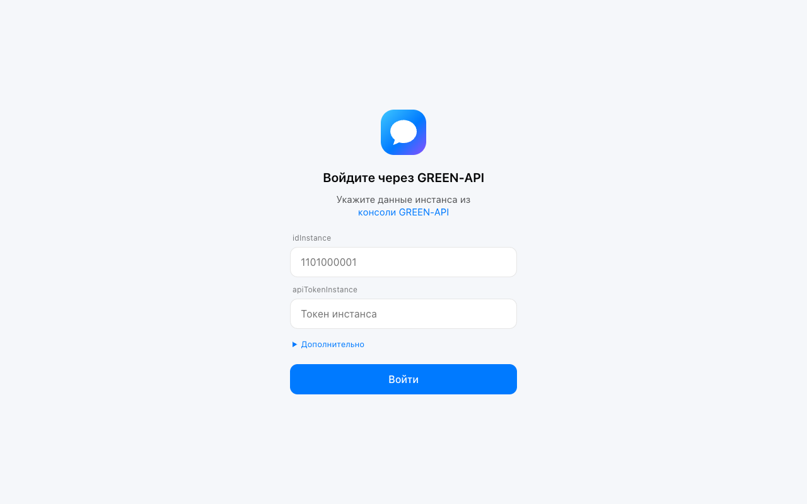
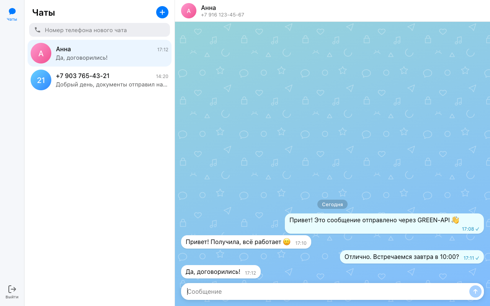
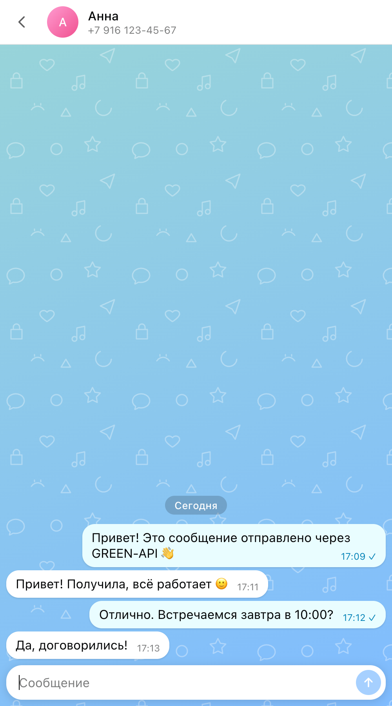

# GREEN-API Chat

Простой веб-чат для отправки и получения текстовых сообщений через сервис
[GREEN-API](https://green-api.com/). Интерфейс выполнен по прототипу веб-версии мессенджера
[MAX](https://web.max.ru/).

> **Выбор мессенджера.** Задание допускает реализацию для WhatsApp или Telegram, если нет
> возможности выполнить его для MAX. Приложение реализовано для инстанса **Telegram**.
> Методы GREEN-API (`sendMessage`, `receiveNotification`, `deleteNotification`) одинаковы
> для всех мессенджеров, поэтому код не привязан к Telegram: для работы с инстансом MAX
> достаточно указать его `idInstance`, `apiTokenInstance` и `apiUrl`.

- **Демо:** https://Alexandr4e.github.io/green-api-chat/
- **Демо-режим без учётных данных** (фиктивная переписка для просмотра интерфейса):
  https://Alexandr4e.github.io/green-api-chat/?demo=1

| Вход | Чат | Мобильная версия |
|---|---|---|
|  |  |  |

## Возможности

1. Вход по учётным данным инстанса GREEN-API (`idInstance`, `apiTokenInstance`).
   Данные проверяются методом `getStateInstance` (инстанс должен быть в состоянии `authorized`).
2. Создание нового чата по номеру телефона получателя.
3. Отправка текстового сообщения — метод
   [SendMessage](https://green-api.com/v3/docs/api/sending/SendMessage/).
4. Получение входящих сообщений — технология
   [HTTP API](https://green-api.com/v3/docs/api/receiving/technology-http-api/):
   цикл `ReceiveNotification` (long polling, `receiveTimeout=5`) → обработка → `DeleteNotification`.
5. Отображение ответов собеседника в чате. Также показываются сообщения, отправленные вами
   с телефона (`outgoingMessageReceived`).

Обрабатываются только текстовые сообщения (`textMessage`, `extendedTextMessage`), остальные
уведомления подтверждаются и пропускаются.

## Локальный запуск

Требуется Node.js 20.19+ или 22.12+ (требование Vite 8).

```bash
git clone https://github.com/Alexandr4e/green-api-chat.git
cd green-api-chat
npm install
npm run dev
```

Откройте http://localhost:5173.

Сборка production-версии: `npm run build` (результат в `dist/`), предпросмотр: `npm run preview`.

## Подготовка инстанса GREEN-API

1. Зарегистрируйтесь в [консоли GREEN-API](https://console.green-api.com), создайте инстанс
   (MAX, Telegram или WhatsApp) и авторизуйте его.
2. В настройках инстанса:
   - поле **URL для получения уведомлений (webhookUrl) оставьте пустым** — иначе уведомления
     уйдут на webhook и не попадут в очередь HTTP API;
   - включите получение входящих уведомлений о сообщениях (`incomingWebhook`), при желании —
     уведомления об исходящих (`outgoingWebhook`, `outgoingAPIMessageWebhook`).
3. Скопируйте `idInstance` и `apiTokenInstance`. Адрес API по умолчанию — `https://api.green-api.com`;
   если в консоли у инстанса указан другой API URL, введите его на форме входа в блоке «Дополнительно».

## Как пользоваться

1. Введите `idInstance`, `apiTokenInstance` и нажмите «Войти».
2. В поле «Номер телефона для нового чата» введите номер получателя в международном формате
   (`+7 999 123-45-67`, `79991234567` и т. п.) и нажмите «+».
3. Напишите сообщение и нажмите Enter (Shift+Enter — перенос строки).
4. Ответ получателя появится в чате в течение нескольких секунд.

> Чат, созданный по номеру (`79991234567@c.us`), после первого сообщения может
> получить числовой chatId (так ведёт себя, например, Telegram). Приложение сопоставляет его по `idMessage` отправленного
> сообщения и объединяет переписку в один чат.

## Структура

```
src/
  api/greenApi.ts            запросы к GREEN-API (sendMessage, receive/deleteNotification, getStateInstance)
  hooks/useNotifications.ts  цикл получения уведомлений по HTTP API
  store.ts                   reducer состояния чатов и сообщений
  components/
    LoginForm.tsx            форма входа
    NavRail.tsx              левая панель навигации
    Messenger.tsx            экран мессенджера: состояние, отправка, обработка уведомлений
    Sidebar.tsx              список чатов и создание чата по номеру
    ChatWindow.tsx           окно переписки
    MessageBubble.tsx        сообщение
    MessageInput.tsx         поле ввода
    Avatar.tsx               аватар с инициалами
    icons.tsx                SVG-иконки
  utils/                     номера телефонов, разбор уведомлений, sessionStorage, время
  demo.ts                    данные для демо-режима (?demo=1)
```

CSS организован по методологии BEM (`block__element--modifier`), стили — в `src/index.css`.
Цвета, скругления, размеры панелей и шрифтовая шкала вынесены в CSS-переменные и соответствуют
светлой теме web.max.ru. Логотип и фоновый узор — собственные, бренд MAX не используется.

Стек: React 19, TypeScript, Vite. Внешних зависимостей, кроме React, нет.
Учётные данные и история чатов хранятся только в `sessionStorage` браузера: они сохраняются при
перезагрузке страницы и удаляются при закрытии вкладки или нажатии «Выйти».
Деплой на GitHub Pages — GitHub Actions (`.github/workflows/deploy.yml`).
